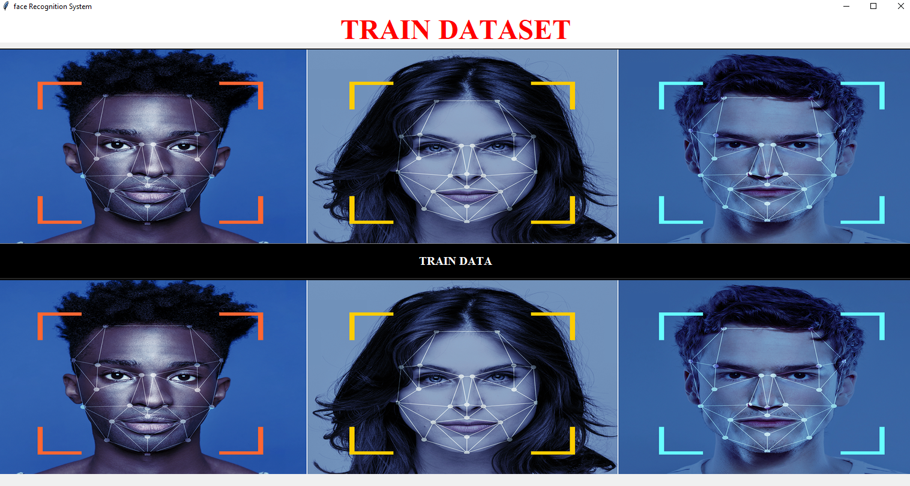
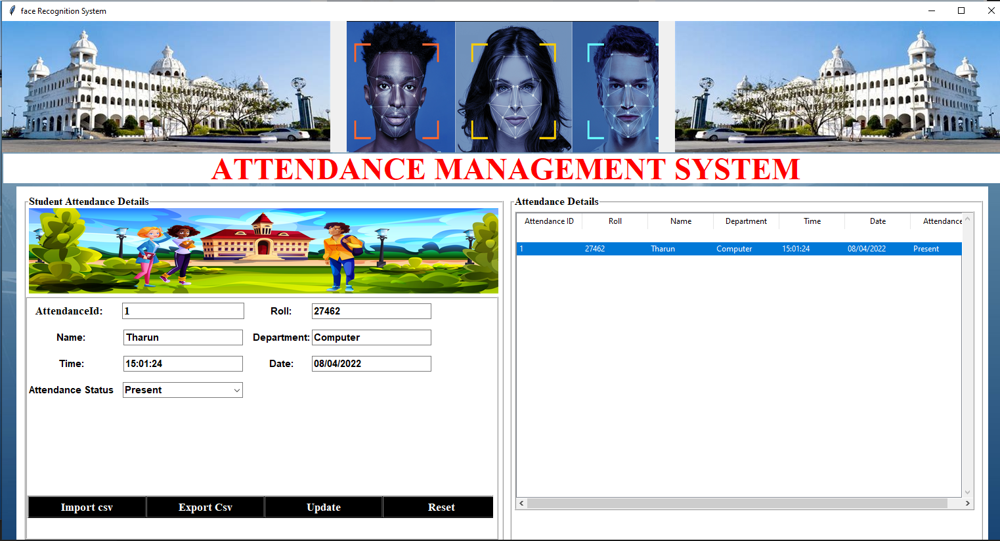

# Attendance Based On Face Recognization

A real-world student attendance system which recognizes face of student and attendance of the respective student will be marked automatically on excel sheet


## Developers

- [@TharunreddyR](https://github.com/R-TharunReddy)
- [@Vamsi Bhogaraju](https://github.com/vamsibhogaraju)
- [@Navamshuram](https://github.com/navamshuram/Attendance-Management-System-Using-Facial-Recognition)


## Demo


## Deployment

To use this project run

```bash
  login.py -- 1
  main.py --2
```


## Features


- Dynamic Face Recognization
- 60fps speed smooth coding while using web cam
- Automatic attendance savng in csv file
- Import/Export option for csv files.


## 🚀 About Me
I'm a full stack developer...


## Installation

Install my-project with the github source code option

```bash
  install required libraries from requirments.txt
```
    
## Screenshots<br>
Main Interface
<br>
<br>Student page
<br><br>Train page
<br><br>Test page
<br><br>Result 
<br><br>Result1
<br><br>Result2
<br><br>Details
<br><br>


## Tech Stack

**Server:** Python and its libraries,computer vision,Machine learning

**Client:** GUI (interface),Tkinter


## Requirments

[ 3.4 SYSTEM REQUIREMENT ]

    3.4.1	Software Requirements Platform: 
 
        1.	Operating System: Windows OS 
 
        2.	Platform: Android Studio / visual studio code
 
        3.	Programming Language: PYTHON 
 
    3.4.2	Hardware Requirements 
 
        1.	Processor:  INTEL Pentium 4 Processor Core 
 
        2.	 Hard Disk: 40 GB (min) 
 
        3.	RAM: 256 MB or higher 

